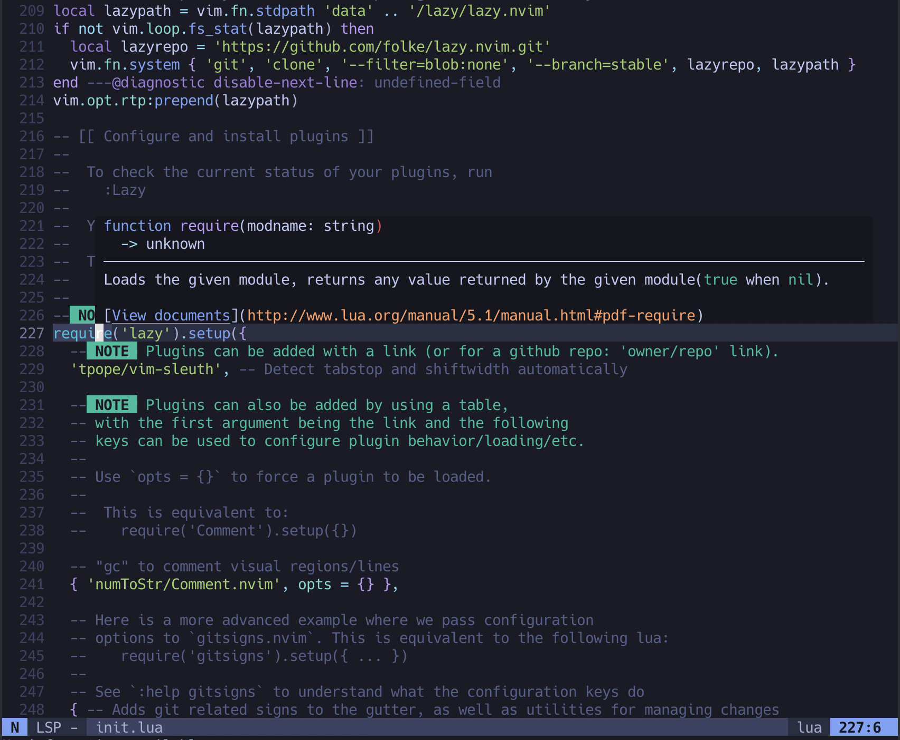
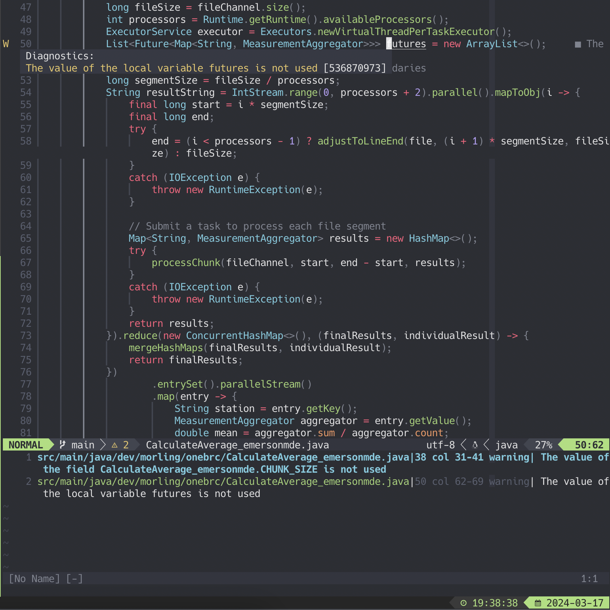

Over the past 5 years I've been hooked on [JetBrains](https://www.jetbrains.com/) 
IDEs. It really started with using [IntelliJ](https://www.jetbrains.com/idea/) 
for Java at work. I was impressed with the number of useful tools and features 
that came with IntelliJ from refactoring code, to code completions including 
dependencies, to an excellent built in debugger and so much more. All of these 
made me far more efficent writing Java with IntelliJ than I was in other 
languages. At the time I was a a devout Vim acolyite and spent many late 
nights trying to find the optimal setup. As it turns out IntelliJ's default 
settings covered almost everything I wanted. In comparison my Vim setup was 
lacking many of the features I came to rely on which would take significant 
effort to replicate with far less polish in Vim. It wasn't long before I was 
paying for the JetBrains All Products bundle for side projects as well.

While [IdeaVim](https://github.com/JetBrains/ideavim) was good enough to 
provide familiar Vim motions and some basic features there were ocasionally 
more complex commands that I wanted to use that I found were missing. I also 
didn't get into fully configuring IdeaVim, relying more on the IntelliJ 
configuration options. Beyond IdeaVim, there were other downsides that are 
obvious from the start but were secondary to the functionality offered. The 
intense indexing process often made the IDE unusable at times and lead to very 
slow start up times. There are few programs that devour RAM faster than 
Chrome, but IntelliJ often wins out. Also JetBrains releases specific versions 
of Idea with integrations and tools for specific languages such as PyCharm for 
Python or RubyMine for Ruby but that often results in managing multiple 
applications and switching between them or accepting some tradeoffs by using 
language specific plugins in IntelliJ.

## Back To The Future

I saw coworkers, streamers, and YouTubers using NeoVim and noticed these new 
setups looked far better than what was available when I was daily driving Vim. 
Many also showcased features like code actions that I thought were unique to 
IntelliJ and other similar full featured IDEs. After some investigation, setups 
like these were pretty common and to my surprise they didn't take thousands of 
lines of custom VimScript or a host of plugins. Many of these context aware 
features came from the usage of [language servers](https://langserver.org/). 
These language servers implment the 
[Language Server Protocol](https://microsoft.github.io/language-server-protocol/), 
a standard protocol originally developed by Microsoft and used in VSCode to 
allow language maintainers and communities to build code aware capabilities 
agosnotic of the editor. 

Although I knew these setups existed and there were great video walkthroughs 
available, I knew this could be a significant time sink. To avoid the 
enividible start up cost I turned to a NeoVim distrobution, 
[LunarVim](https://www.lunarvim.org/). This distro looks great and comes with 
batteries included designed as a fully working IDE. As good as this sounded 
at first, I quickly ran into issues I had with the provided defaults and 
found myself diving into the config anyway. The downside was now I had to 
learn the LunarVim abstractions on top of the underlying plugins and NeoVim 
config. I ended up abandonding the exparimient and returning to the world of 
JetBrains.

## NeoVim Kickstart

After a few more months had past, I came across 
[NeoVim Kickstart](https://github.com/nvim-lua/kickstart.nvim), a small well 
documented starting config that includes completions, LSP servers, and looks 
great out of the box. There was also 
[a great video](https://www.youtube.com/watch?v=m8C0Cq9Uv9o) 
by [TJ DeVries](https://www.youtube.com/@teej_dv/videos), the creator of NeoVim 
Kickstart and a NeoVim core maintainer, that explains in detail what each line 
does and how to further customize it. 




This was a great way to get into NeoVim. Its written all in Lua, not my 
preference but signficiantly better than bespoke VimScript, and since it is 
well documented it was easy to add on to or change as needed. I found it struck 
the perfect balance between predefined functionality and customizability. 

Kickstart comes configured with [Mason](https://github.com/williamboman/mason.nvim), 
a plugin that manages external tooling such as LSP servers, linters, and 
formatters. Most of these work just out of the box with minimal config. Java 
on the other hand, took a lot of trial and error.

## Lombok 

Mason can automatically install and configure the 
[Eclipse JDT Language Server](https://github.com/eclipse-jdtls/eclipse.jdt.ls) 
which works well enough but did not automatically recognize Lombok annotations. 
This seemed odd because it has a Lombok setting which defaults to true. Some 
posts online suggested including the Lombok JAR and specifying it in the Java 
falgs in the JDT-LS settings. Sounds easy enough.

I spent the next few hours learning Lua and creating an 
[initialization function](https://github.com/emersonmde/.dotfiles/commit/ae30c7cd369348841817ea04191491d82aaa6488) 
that would automatically install JDT-LS and the Lombok JAR then configure the LSP
outside of Mason. In the end I realized this would be painful to maintain in 
the future. Some of the links had to be hard coded, some required special 
handlers to verify checksums, and all of the steps required seemed fragile. 

## This Is The Way

I decided to start over, leaning on Mason to download and maintain the JDT 
language server and the Lombok JAR but instead of using Mason-LspConfig I would 
use [`mfussenegger/nvim-jdtls`](https://github.com/mfussenegger/nvim-jdtls) 
to configure JDT-LS.

First I added `jdtls` to the `servers` table so Mason 
would automatically download everything needed, then added a `skip_setup` key
to avoid configuring it with `lspconfig`:

```lua
mason_lspconfig.setup_handlers {
  function(server_name)
    if servers[server_name] ~= nil and servers[server_name].skip_setup then
      return
    end
    require('lspconfig')[server_name].setup {
      capabilities = capabilities,
      on_attach = on_attach,
      settings = servers[server_name],
      filetypes = (servers[server_name] or {}).filetypes,
    }
  end,
}
```


Then added a function to configure `jdtls` with `nvim-jdtls`:

```lua
local function jdtlsConfig()
  local os_name = vim.loop.os_uname().sysname
  local arch = vim.loop.os_uname().machine
  local config_dir_name = 'config_linux'
  if os_name == 'Darwin' then
    config_dir_name = arch == 'x86_64' and 'config_mac' or 'config_mac_arm'
  elseif os_name == 'Linux' then
    config_dir_name = arch == 'x86_64' and 'config_linux' or 'config_linux_arm'
  end
  local jdtls_dir = home .. '/.local/share/nvim/mason/packages/jdtls'
  local config_path = jdtls_dir .. "/" .. config_dir_name

  local project_name = vim.fn.fnamemodify(vim.fn.getcwd(), ":p:h:t")
  local workspace_dir = jdtls_dir .. '/workspace/' .. project_name

  local function on_init(client)
    if client.config.settings then
      client.notify("workspace/didChangeConfiguration", { settings = client.config.settings })
    end
  end

  local bundles = {}
  local extendedClientCapabilities = require("jdtls").extendedClientCapabilities
  extendedClientCapabilities.resolveAdditionalTextEditsSupport = true

  return {
    cmd = {
      'java', -- or '/path/to/java11_or_newer/bin/java'
      '-Declipse.application=org.eclipse.jdt.ls.core.id1',
      '-Dosgi.bundles.defaultStartLevel=4',
      '-Declipse.product=org.eclipse.jdt.ls.core.product',
      '-Dlog.protocol=true',
      '-Dlog.level=ALL',
      '-javaagent:' .. jdtls_dir .. '/lombok.jar',
      '-Xms1g',
      '--add-modules=ALL-SYSTEM',
      '--add-opens',
      'java.base/java.util=ALL-UNNAMED',
      '--add-opens',
      'java.base/java.lang=ALL-UNNAMED',

      '-jar',
      vim.fn.glob(jdtls_dir .. '/plugins/org.eclipse.equinox.launcher_*.jar'),

      '-configuration',
      config_path,

      '-data',
      workspace_dir,
    },
    flags = {
      debounce_text_changes = 150,
      allow_incremental_sync = true,
    },
    handlers = {},
    root_dir = require('jdtls.setup').find_root({ 'build.gradle', 'pom.xml', '.git' }),
    capabilities = require('cmp_nvim_lsp').default_capabilities(vim.lsp.protocol.make_client_capabilities()),
    on_init = on_init,
    on_attach = on_attach,
    init_options = {
      bundles = bundles,
      extendedClientCapabilities = extendedClientCapabilities,
    },
    settings = {
      java = {
        signatureHelp = { enabled = true },
        configuration = {
          updateBuildConfiguration = 'interactive',
        },

        eclipse = {
          downloadSources = true,
        },
        maven = {
          downloadSources = true,
        },
        implementationsCodeLens = {
          enabled = true,
        },
        referencesCodeLens = {
          enabled = true,
        },
        references = {
          includeDecompiledSources = true,
        },
        inlayHints = {
          parameterNames = {
            enabled = 'all',
          },
        },
        completion = {
          favoriteStaticMembers = {
            'org.hamcrest.MatcherAssert.assertThat',
            'org.hamcrest.Matchers.*',
            'org.hamcrest.CoreMatchers.*',
            'org.junit.jupiter.api.Assertions.*',
            'java.util.Objects.requireNonNull',
            'java.util.Objects.requireNonNullElse',
            'org.mockito.Mockito.*',
          },
        },
        sources = {
          organizeImports = {
            starThreshold = 9999,
            staticStarThreshold = 9999,
          },
        },
        codeGeneration = {
          toString = {
            template = '${object.className}{${member.name()}=${member.value}, ${otherMembers}}',
          },
          useBlocks = true,
        },
      },
    },
  }
end
```

Finally, I just had to call this function when editing Java files:
```lua
vim.api.nvim_create_autocmd("FileType", {
  pattern = "java",
  callback = function()
    require("jdtls.setup").add_commands()
    require("jdtls").start_or_attach(jdtlsConfig())
  end,
})
```

## Whats Left?

Java was the only real gap to fill. Besides Java, I added `vim-tmux-navigator`:
```lua
require('lazy').setup({
  -- ...
  {
    "christoomey/vim-tmux-navigator",
    cmd = {
      "TmuxNavigateLeft",
      "TmuxNavigateDown",
      "TmuxNavigateUp",
      "TmuxNavigateRight",
      "TmuxNavigatePrevious",
    },
    keys = {
      { "<c-h>",  "<cmd><C-U>TmuxNavigateLeft<cr>" },
      { "<c-j>",  "<cmd><C-U>TmuxNavigateDown<cr>" },
      { "<c-k>",  "<cmd><C-U>TmuxNavigateUp<cr>" },
      { "<c-l>",  "<cmd><C-U>TmuxNavigateRight<cr>" },
      { "<c-\\>", "<cmd><C-U>TmuxNavigatePrevious<cr>" },
    },
  },
})
```

And some colorscheme updates:
```lua
require('lazy').setup({
  -- ...
  {
    "sainnhe/sonokai",
    config = function()
      vim.g.sonokai_style = "default"
      vim.g.sonokai_disable_italic_comment = true
      vim.g.sonokai_menu_selection_background = "green"
      vim.opt.termguicolors = true
      vim.cmd.colorscheme("sonokai")
    end
  },
})

local custom_auto = require('lualine.themes.auto')

custom_auto.normal.a.bg = '#a7df78'
custom_auto.insert.a.bg = '#85d3f2'

require('lualine').setup {
  options = { theme = custom_auto },
}
```

With these few changes, NeoVim has quickly become my go to IDE. It's snappy, 
functional, easy to add on to, and it looks great. I think I may have found the 
long awaited IntelliJ killer, it just happened to be lurking in the background 
all along.




