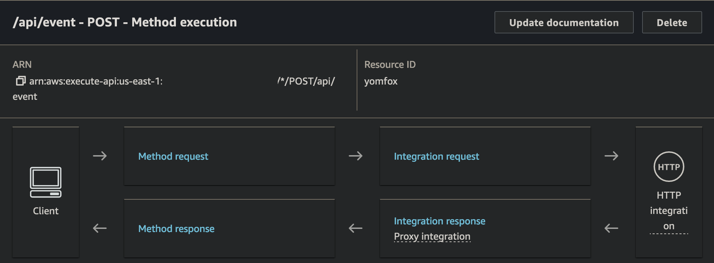
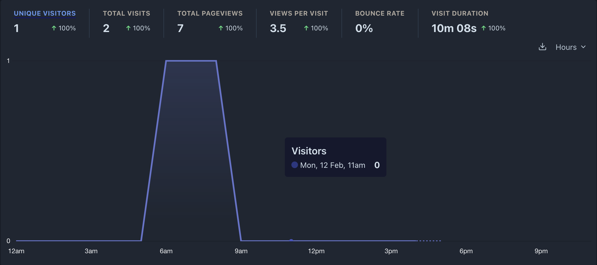
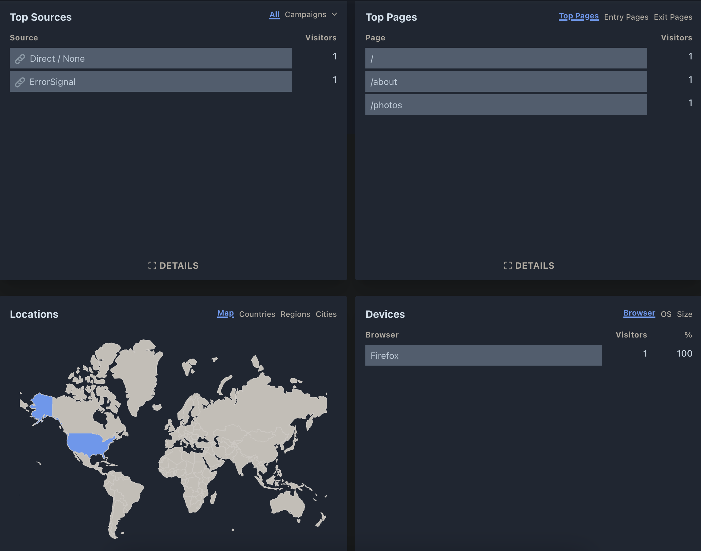

I'm a strong believer in Robert Heinlein's quote, "When one teaches, two 
learn." To that end, my primary motivation to write these posts was to 
reinforce my own understanding of the topics I touch on in my personal 
projects. However, I still hope to provide value to others who may be 
exploring these topics for the first time. While the first goal is mostly 
subjective, the second is more easily measured.

# The World of Analytics
In my day job, analytics is often a crucial part of the software we build. 
Metrics and statistics are collected for just about anything measurable, 
from clicks, to API calls, to host metrics, and everything inbetween. Amazon 
has a huge array of tools and services for collecting, storing, and analyzing
metrics. However, for my personal projects, I don't need anything nearly as 
complex, leaving aside the effort it would take to recreate similar tooling 
for use externally. 

I was aware of services like Google Analytics that simplify the process of 
collecting and analyzing metrics, but I haven't really explored them. I'm also 
aware of the privacy concerns that come with using Google Analytics, but I 
wasn't sure of what alternatives were available. When I set out on this 
journey, one of the first videos I stumbled upon was 
[a video](https://www.youtube.com/watch?v=6xXSsu0YXWo) by 
[Theo - t3.gg](https://www.youtube.com/@t3dotgg) where he showcases two 
alternatives to Google Analytics: Plausible and PostHog. While PostHog is 
incredible powerful, it's overkill for my needs. Plausible is exactly what I 
was looking for: a simple, open source, privacy-friendly alternative to
Google Analytics.

# Setting Up Plausible
Setting up Plausible can be incredibly simple. All you need to get started 
is an account and a script provided by Plausible that records events. Each 
new account comes with a 30 day free trial with no up front payment details 
required. After the free trial the service costs £9/month for up to 10,000 
page views with the option of [self-hosting](https://plausible.io/self-hosted-web-analytics) 
for free. In my case, another $12/month subscription wasn't ideal, but 
something I would gladly pay for a privacy focused alternative to the big 
players in the space. 

Since there is no credit card required to sign up, 
[creating an account](https://plausible.io/register) was straight forward. 
After signing up, you register your domain in their dashboard and are 
presented with a script tag to include in your website.

```html
<script defer data-domain="yourdomain.com" src="https://plausible.io/js/script.js"></script>
```

Simply replacing your domain with the domain you registered with Plausible 
and including this script in the head of your website is all you need to start 
collecting metrics. 

This works for most websites, however, thanks to the 
ad blocker arms race, well known tracking scripts like this are usually 
blocked. Given my audience is likely to be more technically inclined, many of 
the visitors to my site are likely to have an ad blocker installed reducing 
the effectiveness of this approach. A primary reason I use an ad blocker is 
to protect against cross domain tracking from companies like Google and Meta,
but I'm not against website owners collecting metrics on their own site. 
Thankfully Plausible has a [guide on setting up a proxy](https://plausible.io/docs/proxy/introduction) 
to bypass the simple matching logic used by most ad blockers. In this guide 
they also provide a interesting breakdown of the privacy focused aspects of 
using Plausible:

> Plausible is simply doing web analytics the way it was at the start before 
> surveillance capitalism became the default business model of the web:
>
>    No cookies and other persistent identifiers.
> 
>    No connection to the adtech, and surveillance capitalism.
> 
>    No personal data is collected, and all stats are in aggregate only.
> 
>    No cross-site or cross-device tracking.
> 
>    You 100% own your website data, and it isn't sent to, shared with or sold to any third-parties.
> 
>    Open source web analytics software that can be self-hosted.

It is easy to re-host the script from any static file host, but one of the 
primary goals for [creating this website using Gatsby and GitHub Pages](../hello-gatsby) 
was to avoid the need for an API. Nevertheless, I wanted to set up a proxy API 
in order to get some useful metrics out of Plausible. Fortunately I had 
already set up an API using [API Gateway](https://aws.amazon.com/api-gateway/) 
defined in [AWS's Cloud Development Kit (CDK)](https://aws.amazon.com/cdk/) for 
a previous personal website. The biggest downside was I haven't touched it in 
over 2 years. After cutting through the deprecation messages and cobwebs it was 
easier than I expected to get the new endpoint working.

## API Gateway Proxy
In Plausible's guide on [setting up a proxy](https://plausible.io/docs/proxy/introduction), 
they provide samples for many different hosting services but none for API 
Gateway or CDK. The good news is this is only a few lines of code if you 
already have a API Gateway defined in CDK.

```typescript
const api = new apigateway.RestApi(...);
const apiResource = api.root.addResource('api');
const eventsResource = apiResource.addResource('event');
const plausibleIntegration = new apigateway.HttpIntegration('https://plausible.io/api/event', {
  httpMethod: 'POST',
  proxy: true
});
eventsResource.addMethod('POST', plausibleIntegration);
```

After deploying with `cdk deploy ApiStack`, the new endpoint was configured 
to proxy requests to `https://plausible.io/api/event`. Setting `proxy: true` 
ensures that the request is passed through to the target without modification.



After setting up the proxy API, the [event script](https://plausible.io/js/script.js) 
can be downloaded and hosted in with the rest of the static files. Just make 
sure you don't name it `plausible.js` as your ad blocker will helpfully 
block anything that with that keyword.

Once the proxy and self hosted script are in place, the script tag can be 
updated with the new values.

```html
<script defer data-api="your-event-proxy-url.com/api/event" 
        data-domain="your-domain.com" 
        src="/js/totally-not-tracking-script.js"></script>
```

## Referral Metrics
One of the metrics I was interested in seeing was to see how many people 
followed the link from my blog to my older site which mainly hosts my 
photography. When I first set up Plausible, I noticed all the sources 
were "None/Direct". In order to provide a more useful source, Plausible 
supports using a `ref` query parameter that can be set on any shared links.

```html
<a href="https://your-domain.com?ref=blog" target="_blank" rel="noopener">Link</a>
```

With this in place, metrics from both of my domains are now being flowing in
with the correct referral source despite using an ad blocker.

# Profit

So what do you get after all of this? Plausible provides a dashboard to view 
aggregated user metrics. The data updates in near real time and allows you 
to break down many of the metrics by time, device, source, and more. There 
are ways to add custom metrics and additional graphs, but the default 
dashboard works just fine for my needs.



In addition to the overall view metrics graph, the dashboard also includes 
graphs for Top Sources, Top Pages, Locations, and Devices.



Overall I've been extremely pleased with how simple this process was along with 
the great documentation which had an answer for most of the problems I faced. 
It remains to be seen if I will end up getting $12/month of value out of the 
service and start paying for it full time, but I cannot recommend it enough if 
you need a simple privacy focused analytics solution.